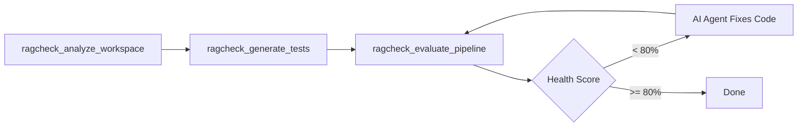

<p align="center">
  <h1 align="center">RAGCheck</h1>
  <p align="center">
    <strong>The open-source RAG evaluation skill for AI coding agents</strong>
  </p>
  <p align="center">
    Evaluate, diagnose, and autonomously fix your RAG pipelines — without leaving your IDE.
  </p>
  <p align="center">
    <a href="#quick-start">Quick Start</a> &bull;
    <a href="#how-it-works">How It Works</a> &bull;
    <a href="#ide-setup">IDE Setup</a> &bull;
    <a href="#supported-providers">Providers</a> &bull;
    <a href="#contributing">Contributing</a>
  </p>
  <p align="center">
    <a href="https://github.com/qsprasanna/RAGCheck/stargazers"></a>
    <a href="https://github.com/qsprasanna/RAGCheck/blob/main/LICENSE"></a>
    <a href="https://python.org"></a>
    <a href="https://modelcontextprotocol.io"></a>
  </p>
</p>

---

## The Problem

You built a RAG pipeline. It works... mostly. But:

- Your chatbot **hallucinates** facts that aren't in the documents
- The retriever **misses** critical context chunks
- You don't know which queries fail or **why**
- Testing requires leaving your IDE to run complex evaluation frameworks

RAGCheck solves this by bringing RAG evaluation **inside your AI coding agent** as a native MCP skill.

---

## The Solution

RAGCheck is an [MCP server](https://modelcontextprotocol.io) that gives your AI assistant (Cursor, Claude Code, Windsurf, Codex) the ability to **test, score, and fix** your RAG pipeline autonomously.

```
You: "RAGCheck — scan my pipeline and fix any hallucinations."

Agent: ✅ Analyzed 47 document chunks from docs/
       ✅ Generated 10 synthetic test questions
       ✅ Evaluated pipeline — Health Score: 62/100
       ❌ Groundedness: 0.45 (hallucinating equipment costs)
       ❌ Context Recall: 0.58 (missing Engineering team exception)
       
       🛠️ Fixing: Updated chunk_size from 512→1024 in retriever.py
       🛠️ Fixing: Added "only cite retrieved context" to system prompt
       
       ✅ Re-evaluated — Health Score: 94/100
```

**No dashboards. No test scripts. No context switching.** Just ask.

---

## How It Works

RAGCheck exposes three MCP tools that chain together into an autonomous evaluation loop:



### Step 1: Analyze Workspace
```
ragcheck_analyze_workspace(docs_dir="./docs")
```
Parses your `.md`, `.txt`, and `.pdf` files. Chunks text using a sliding window. Stores everything in a local SQLite database (`.ragcheck/ragcheck.db`). Zero external dependencies.

### Step 2: Generate Tests
```
ragcheck_generate_tests(num_questions=10, difficulty="mixed")
```
Uses an LLM to read your chunks and generate Question-Context-Answer (QCA) pairs — a synthetic "golden dataset" for evaluation. No manual test writing required.

### Step 3: Evaluate Pipeline
```
ragcheck_evaluate_pipeline(
  test_dataset_path=".ragcheck/tests.json",
  rag_entrypoint_cmd="python query.py"
)
```
Runs your RAG pipeline as a subprocess for each test question. An LLM judge grades each response on:

| Metric | What It Measures | Failure Signal |
|--------|-----------------|----------------|
| **Groundedness** | Is the answer faithful to the retrieved context? | Hallucination detected |
| **Context Recall** | Did the retriever fetch all necessary chunks? | Missing information |

Returns a structured JSON report with:
- Overall health score (0-100)
- Per-metric scores with reasoning
- **Actionable fix recommendations** targeting specific files

---

## Quick Start

### One-Line Install

```bash
uvx git+https://github.com/qsprasanna/ragcheck-mcp.git
```

### Add to Your IDE

Add this to your MCP server configuration:

```json
{
  "name": "ragcheck",
  "command": "uvx",
  "args": ["git+https://github.com/qsprasanna/ragcheck-mcp.git"],
  "env": {
    "OPENAI_API_KEY": "your-key",
    "ANTHROPIC_API_KEY": "your-key"
  }
}
```

### Run It

Ask your AI assistant:

> "Use RAGCheck to analyze my `docs/` folder, generate 5 test questions, and evaluate my pipeline using `python query.py` as the entrypoint."

That's it. The agent handles everything.

---

## IDE Setup

<details>
<summary><strong>Cursor</strong></summary>

Go to **Cursor Settings > Features > MCP** and add:
```json
{
  "name": "ragcheck",
  "command": "uvx",
  "args": ["git+https://github.com/qsprasanna/ragcheck-mcp.git"],
  "env": {
    "OPENAI_API_KEY": "sk-your-key-here",
    "ANTHROPIC_API_KEY": "sk-ant-your-key-here"
  }
}
```
</details>

<details>
<summary><strong>Claude Code / Claude Desktop</strong></summary>

Add to your `claude_desktop_config.json` (Mac: `~/Library/Application Support/Claude/`):
```json
{
  "mcpServers": {
    "ragcheck": {
      "command": "uvx",
      "args": ["git+https://github.com/qsprasanna/ragcheck-mcp.git"],
      "env": {
        "OPENAI_API_KEY": "sk-your-key-here",
        "ANTHROPIC_API_KEY": "sk-ant-your-key-here"
      }
    }
  }
}
```
</details>

<details>
<summary><strong>Windsurf / Devin</strong></summary>

Edit `~/.codeium/windsurf/mcp_config.json`:
```json
{
  "mcpServers": {
    "ragcheck": {
      "command": "uvx",
      "args": ["git+https://github.com/qsprasanna/ragcheck-mcp.git"],
      "env": {
        "OPENAI_API_KEY": "sk-your-key-here",
        "ANTHROPIC_API_KEY": "sk-ant-your-key-here"
      }
    }
  }
}
```
</details>

<details>
<summary><strong>Codex / Other MCP Clients</strong></summary>

```bash
OPENAI_API_KEY="sk-your-key" ANTHROPIC_API_KEY="sk-ant-key" \
  uvx git+https://github.com/qsprasanna/ragcheck-mcp.git
```
</details>

---

## Supported Providers

RAGCheck uses [LiteLLM](https://docs.litellm.ai/docs/providers) under the hood — **100+ LLM providers** work out of the box. Bring your own keys:

| Provider | Env Variable | Example Model String |
|----------|-------------|---------------------|
| OpenAI | `OPENAI_API_KEY` | `gpt-4o-mini` (default for generation) |
| Anthropic | `ANTHROPIC_API_KEY` | `anthropic/claude-sonnet-4-6` (default for evaluation) |
| Google Gemini | `GEMINI_API_KEY` | `gemini/gemini-2.0-flash` |
| Groq | `GROQ_API_KEY` | `groq/llama-3.1-70b-versatile` |
| AWS Bedrock | `AWS_ACCESS_KEY_ID` | `bedrock/anthropic.claude-sonnet-4-6` |
| Azure OpenAI | `AZURE_API_KEY` | `azure/gpt-4o-mini` |
| Ollama (local) | — | `ollama/llama3` |
| Together AI | `TOGETHER_API_KEY` | `together_ai/meta-llama/Llama-3-70b` |

Override the default model on any tool call with the `model` parameter.

---

## Example Output

```json
{
  "health_score": 62.5,
  "metrics": [
    {
      "name": "groundedness",
      "score": 0.45,
      "reasoning": "The pipeline hallucinated a $2500 equipment stipend when the actual amount is $1000."
    },
    {
      "name": "context_recall",
      "score": 0.80,
      "reasoning": "Retrieved the general policy but missed the Engineering team exception clause."
    }
  ],
  "failing_metrics": ["groundedness"],
  "recommendations": [
    {
      "target_file": "prompt.py",
      "issue_description": "Groundedness is low (0.45). The model is hallucinating facts.",
      "recommended_action": "update_system_prompt",
      "suggested_code_change": "Add: 'Only answer based on the provided context. If unsure, say I don't know.'"
    }
  ]
}
```

Your AI agent reads this JSON and **applies the fixes automatically**.

---

## Architecture

```
┌─────────────────────────────────────────────────────┐
│                   AI IDE / Agent                      │
│              (Cursor, Claude, Windsurf)               │
└───────────────────────┬─────────────────────────────┘
                        │ MCP (stdio)
                        ▼
┌─────────────────────────────────────────────────────┐
│                RAGCheck MCP Server                    │
│                                                      │
│  ┌─────────────┐  ┌──────────────┐  ┌───────────┐  │
│  │  Ingestion  │→ │  Generation  │→ │ Evaluation │  │
│  │  (chunks)   │  │  (QCA pairs) │  │  (grades)  │  │
│  └─────────────┘  └──────────────┘  └───────────┘  │
│         │                │                 │         │
│         ▼                ▼                 ▼         │
│  ┌─────────────────────────────────────────────┐    │
│  │         .ragcheck/ragcheck.db (SQLite)       │    │
│  └─────────────────────────────────────────────┘    │
└─────────────────────────────────────────────────────┘
                        │
                        │ subprocess
                        ▼
┌─────────────────────────────────────────────────────┐
│            Your RAG Pipeline (any language)           │
│           python query.py "user question"            │
└─────────────────────────────────────────────────────┘
```

**Key design decisions:**
- All state stored locally in `.ragcheck/` — no cloud dependencies
- Evaluates ANY RAG pipeline via subprocess (language agnostic)
- Structured Pydantic JSON output for deterministic agent parsing
- LLM-as-a-judge scoring via LiteLLM (swap providers freely)

---

## Why RAGCheck vs. Alternatives?

| | RAGCheck | Ragas | DeepEval | TruLens | LangSmith |
|---|:---:|:---:|:---:|:---:|:---:|
| Works inside your IDE | **Yes** | No | No | No | No |
| AI agent operates it | **Yes** | No | No | No | No |
| Auto-generates tests | **Yes** | Yes | Partial | No | No |
| Auto-fixes your code | **Yes** | No | No | No | No |
| Framework agnostic | **Yes** | Partial | Yes | No | No |
| No signup required | **Yes** | Yes | Free tier | Free tier | Free tier |
| Local-first (no data leaves) | **Yes** | Yes | Yes | No | No |
| Open source | **Yes** | Yes | Yes | Yes | No |

RAGCheck is the only tool **designed for AI agents to operate on behalf of developers**. Every other tool requires a human to run scripts, read dashboards, and manually fix code.

---

## Roadmap

- [x] Core evaluation engine (Groundedness + Context Recall)
- [x] Synthetic test generation
- [x] MCP server with stdio transport
- [x] Multi-provider support via LiteLLM
- [ ] Knowledge Graph construction for multi-hop questions
- [ ] Retriever diagnostics (BM25 vs Dense vs Hybrid benchmarking)
- [ ] Automatic Prompt Optimization (APO)
- [ ] CI/CD integration (GitHub Actions PR reviewer)
- [ ] Additional metrics (Answer Relevance, Citation Correctness, Latency)
- [ ] Multilingual evaluation support
- [ ] Visual evaluation reports (HTML artifact)

---

## Development

```bash
# Clone and install
git clone https://github.com/qsprasanna/RAGCheck.git
cd RAGCheck/ragcheck-mcp
pip install -e .

# Run the MCP server
python -m ragcheck_mcp.server

# Test the demo pipeline
python ../demo/dummy_rag.py "What is the work from home policy?"
```

### Project Structure

```
RAGCheck/
├── README.md                          # You are here
├── demo/
│   ├── dummy_rag.py                   # Intentionally flawed RAG for testing
│   └── docs/employee_handbook.md      # Ground truth document
└── ragcheck-mcp/
    ├── pyproject.toml
    └── src/ragcheck_mcp/
        ├── server.py                  # MCP tool registration & dispatch
        ├── ingestion.py               # Document parsing & chunking
        ├── generation.py              # Synthetic test generation
        ├── evaluation.py              # Pipeline evaluation & grading
        ├── db.py                      # SQLite storage
        └── models.py                  # Pydantic response schemas
```

---

## Contributing

Contributions are welcome! Here's how to help:

1. **Star this repo** — helps others discover RAGCheck
2. **Try it out** — report bugs and feedback in [Issues](https://github.com/qsprasanna/RAGCheck/issues)
3. **Submit PRs** — see the roadmap above for what's coming next
4. **Share** — tweet about it, write a blog post, tell your AI engineering friends

### Development Setup

```bash
git clone https://github.com/qsprasanna/RAGCheck.git
cd RAGCheck/ragcheck-mcp
pip install -e .
```

---

## Community

- [GitHub Issues](https://github.com/qsprasanna/RAGCheck/issues) — Bug reports & feature requests
- [GitHub Discussions](https://github.com/qsprasanna/RAGCheck/discussions) — Questions & ideas

---

## License

[Apache 2.0](LICENSE) — use it freely in commercial and open-source projects.

---

<p align="center">
  <strong>If RAGCheck helped you ship better RAG, give it a star!</strong><br>
  <a href="https://github.com/qsprasanna/RAGCheck/stargazers">
    
  </a>
</p>
